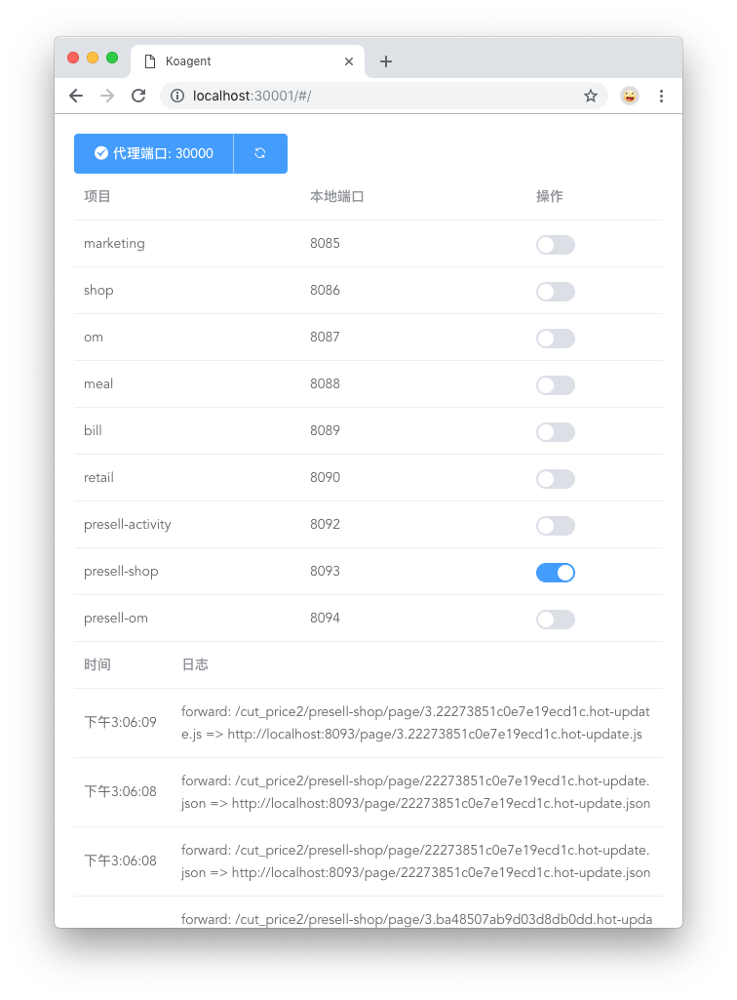

# koagent-dfire

内部Node反向代理项目环境工具

默认端口:

- 管理页面 5106
- 请求代理 5107

## Usage

```bash
sudo npm i -g koagent-dfire

koagent-dfire
```

### 代理请求

> 总体而言，和项目环境一样去请求即可，不需要做修改

#### 转发到项目环境

和现在项目环境一样，支持变更名的切换，如下

```txt
localhost:5107/daily/meal/page/checkout.html
localhost:端口/变更名/项目名/请求路径
```

#### 转发到预发和线上

静态地址

```txt
localhost:5107/publish/meal/page/checkout.html
localhost:端口/环境/项目名/请求路径
```

接口地址

```txt
localhost:5107/publish/api/xxxx
localhost:端口/环境/api关键字/请求路径
```

### 管理

工具启动时，会自动打开一个页面，即为管理页面。如[localhost:5106/](localhost:5106/)

- 打开开关表示使用本地，关闭表示使用转发
- 日志中会有每次请求的代理情况


